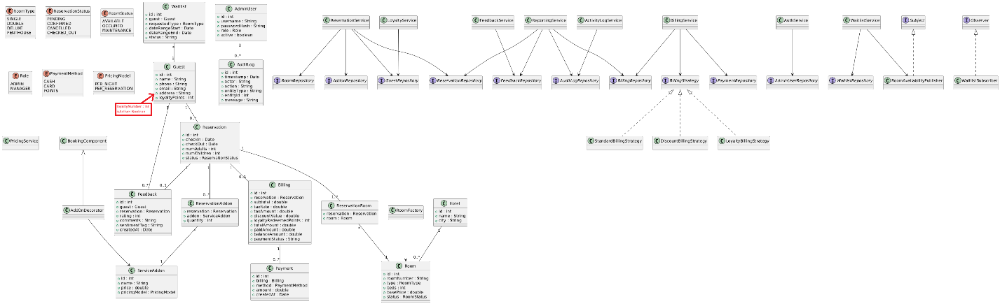
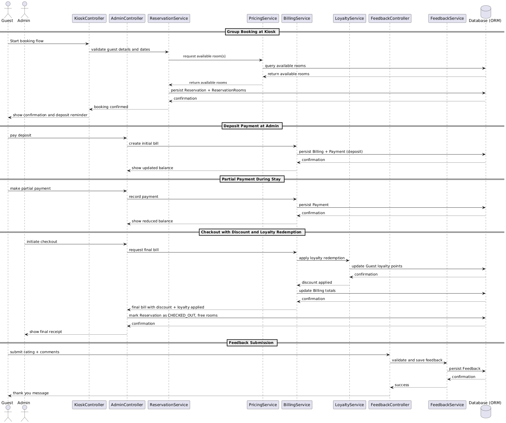
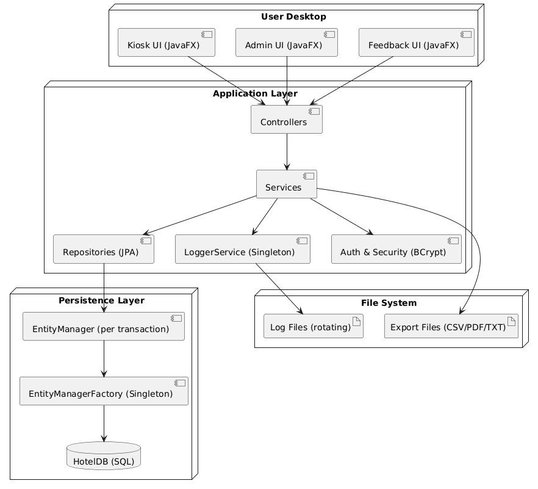
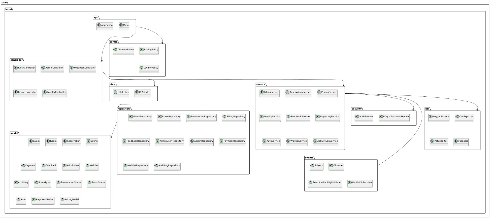
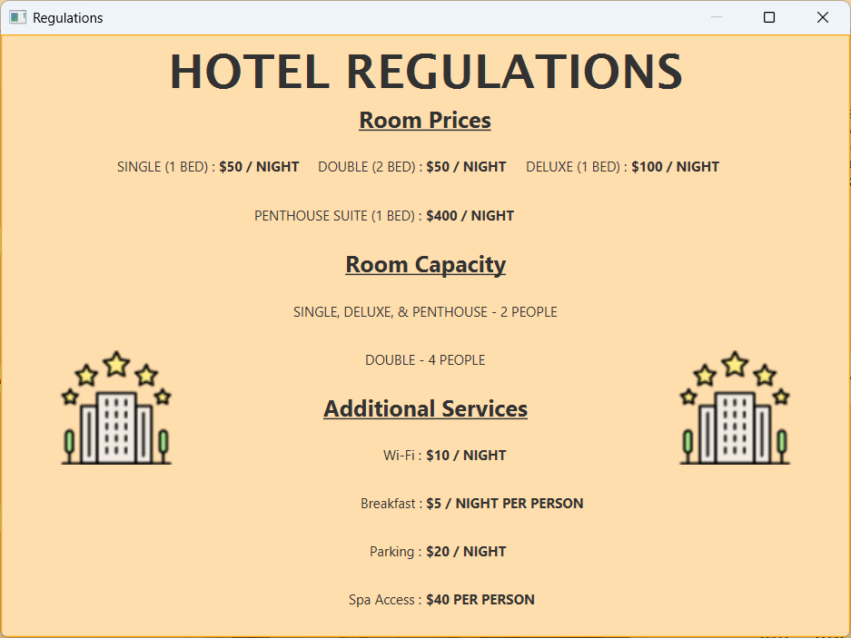

# Come On Inn — Hotel Management System

[](#)
[](#)


The Come On Inn hotel management system is designed to facilitate the automation and digitalization
of bookings and administrative management of the hotel, modernizing its current mode of operation and
setting the foundation for future scalability. It aims to significantly reduce the time and 
organizational efforts required to manage the extensive data kept by the hotel system and implement 
additional security protocols, quick response time, efficient data storage and fast retrieval, accurate 
calculation operations, and reduce the capacity for user error.   

This desktop system is built entirely in Java, covering the full guest lifecycle:
self-serve booking, payment and loyalty tracking, checkout, and post-stay feedback, alongside a
full administrative back office for managing reservations, rooms, rates, and reporting.

## Overview

Come On Inn automates the booking and administrative workflow of a hotel that previously ran on
manual, file-based processes. The goals driving the design: reduce user error in reservations and
billing, give administrators fast, validated tools for managing guests and inventory, and centralize
all data in a single relational store instead of scattered files.

## Features

- Self-serve reservation kiosk with a 5-step guided booking flow and real-time validation
- Configurable checkout supporting discounts, loyalty point redemption, and partial payments
- Loyalty points system — accrual on booking, redemption on payment, admin-configurable earning
  rates and redemption caps
- Waitlist system that notifies admins and can convert directly into a reservation once a room frees up
- Role-based administrative accounts (Admin / Manager) with permission-gated actions
- Secure authentication with BCrypt password hashing
- Audit logging of administrative actions, plus rotating debug logs for the running application
- Data export to PDF, CSV, and TXT for audit logs, feedback, and room occupancy reports
- Post-checkout guest feedback submission and review
- Room and rate management with live occupancy reporting

## Tech Stack

| Concern | Technology |
|---|---|
| Language | Java |
| UI | JavaFX (FXML views, built with SceneBuilder) |
| Dependency Injection | Guice |
| ORM / Persistence | Hibernate (JPA), H2 embedded database |
| Security | BCrypt password hashing |
| Logging | SLF4J |
| Build | Maven |

## Architecture

The application follows a **3-tier MVC architecture**:

- **Client tier (views)** — FXML views built from GridPane, BorderPane, and StackPane layouts.
  StackPanes drive the multi-step kiosk and the admin panel's side navigation, showing one
  focused view at a time instead of a single cluttered screen.
- **Application tier (controllers/services)** — the intermediary between the UI and the database.
  Controllers, services, policies, and utilities here define all business rules and handle CRUD
  requests from the client tier.
- **Data tier (models)** — Hibernate-mapped entities backed by an embedded H2 database, with
  explicit relationships, constraints, and cascading rules defined at the entity level.

Guice performs dependency injection throughout: controllers never instantiate their own
repositories or services, they receive shared singleton instances via injection, which keeps a
single source of truth for each model's data and decouples classes from their dependencies.

### Design Patterns

- **Dependency Injection** — Guice bindings (`GuiceModule`) wire repositories and services as
  singletons into the controllers that need them
- **Repository pattern** — a dedicated repository interface + implementation per entity
- **Singleton** — `EntityManagerFactory`, `SessionFactory`, and all repositories/services
- **Observer** — the waitlist system publishes room-availability events; subscribed admin views
  react and display notifications
- **Factory** — `EntityManagerProvider` supplies a per-transaction `EntityManager` from a shared
  `EntityManagerFactory`

### Class Diagram



### Sequence Diagrams

**Booking, payment, checkout, and feedback flow:**



**Waitlist flow:**



### Deployment Diagram



### Package Diagram



## Data Model

Thirteen entities, mapped with JPA/Hibernate and explicit relationship annotations
(`@OneToOne`, `@ManyToOne`, `@JoinColumn`):

`AdminUser`, `AuditLog`, `Billing`, `Feedback`, `Guest`, `Hotel`, `Payment`, `Reservation`,
`ReservationAddon`, `ReservationRoom`, `Room`, `ServiceAddon`, `Waitlist`

Every entity enforces both back-end constraints (not-null fields, uniqueness, max lengths) and
front-end validation before a request reaches the database — for example, a `Reservation` can't
be created without confirming room availability and capacity first, and `Guest.loyaltyPoints` can
never go negative after a redemption. Cancelling or deleting a `Reservation` cascades to its
`ReservationAddon` and `ReservationRoom` records, immediately freeing the associated rooms for
other bookings.

## Business Rules

- **Rooms:** Single ($50/night, 2 guests), Double ($50/night, 4 guests), Deluxe ($100/night,
  2 guests), Penthouse ($400/night, 2 guests)
- **Add-ons:** Wi-Fi ($10/night), Breakfast ($5/night/person), Parking ($20/night), Spa Access
  ($40/reservation/person)
- **Loyalty:** default earning rate of 1 point per $1 spent (admin-configurable to 0.5x or 2x),
  100 points = $1 off, redemption capped at 1,000 points per billing by default (admin-adjustable
  up to 2,000)
- **Discounts:** capped at 15% for Admins and 30% for Managers
- **Feedback:** one submission per reservation, only after checkout

Any change to these configurable rates generates an audit log entry identifying the admin and the
change made.

## Security & Logging

Authentication runs through a dedicated `AuthService`; passwords are hashed with BCrypt and never
stored or compared in plaintext. The admin interface is fully inaccessible without authentication,
while the guest kiosk, feedback form, and regulations screen remain open to anyone. Two admin
roles (Admin, Manager) gate which configuration actions a user can perform.

Two logging paths run in parallel:
- **Debug logs** — rotating file logs (1MB per file, 10-file cap) for application-level events and
  stack traces, for troubleshooting.
- **Audit logs** — a persisted, queryable record of administrative actions (logins, payments,
  policy changes), independent of the debug logs, viewable and exportable from the admin panel.

## Getting Started

**Prerequisites:** JDK 17+ and Maven (or use the bundled `mvnw` wrapper).

```bash
git clone https://github.com/vladdyz/HotelJava.git
cd HotelJava
mvn clean javafx:run
```

The app uses an embedded H2 database (`./database/appDB`) that initializes and seeds itself
(hotel, rooms, service add-ons) automatically on first run — no separate database setup required.

## Challenges & Learnings

The biggest early challenge was scope: with dozens of interdependent classes across models,
repositories, controllers, and services, it was easy to get lost. Building bottom-up — models
first, then repositories, then controllers, one feature at a time — made the scope manageable and
kept the modular boundaries clean. Choosing H2 over SQLite early on avoided a lot of
version-conflict pain, since H2 runs embedded with no external setup. The trickiest bugs came from
features that touch many services at once (creating a reservation alone involves guest lookup,
room availability, and billing), which made logging and stack traces essential for debugging
rather than optional.

## Possible Future Improvements

- Multi-location support (the current data model assumes a single hotel)
- Full checkout/payment automation rather than front-desk-mediated payment entry
- Automated guest emails (confirmations, feedback reminders) and scheduled report generation
- Multi-admin concurrent sessions with proper concurrency control
- Persistent guest accounts so returning guests can track their own loyalty history
- Guest-selectable room assignment (currently automated)
